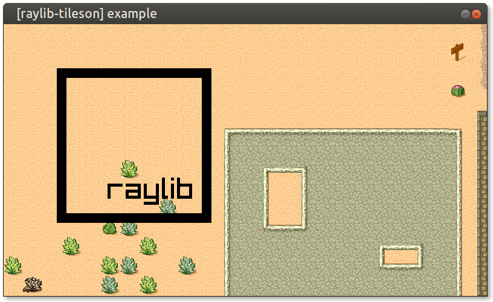

# raylib-tileson

Use [Tiled](https://www.mapeditor.org) maps in [raylib](https://www.raylib.com/), through [Tileson](https://github.com/SSBMTonberry/tileson).

## C++17

While *raylib-tileson* does compile and runs, it requires C++17. Mixing C and C++ may not be preferable by all, so an alternative approach could be [raylib-tmx](https://github.com/robloach/raylib-tmx).

## License

*raylib-tileson* is licensed under the BSD 2-Clause License, see [LICENSE](LICENSE) for more information.
